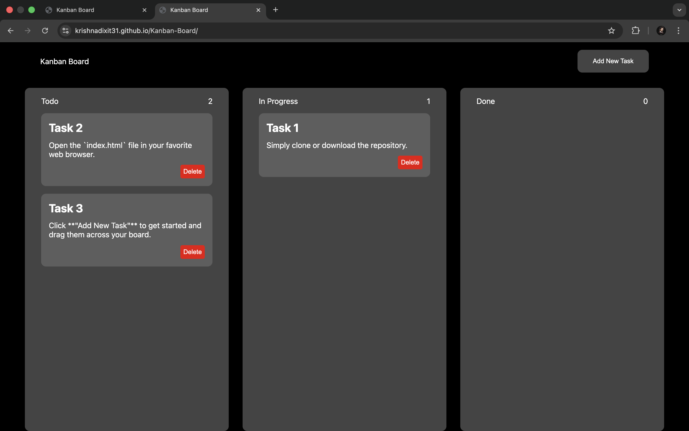

# 📋 Kanban Board - My Task Management Flow

Hey there! 👋 Welcome to my vanilla JavaScript Kanban Board project. 

I built this because I wanted a lightweight, no-nonsense way to manage tasks without relying on heavy frameworks or complex setups. It's a clean, drag-and-drop board that just *works*. All your tasks are saved right in your browser's Local Storage, meaning if you accidentally close the tab, you don't lose your work!

## ✨ What it does (Features)

*   **Drag & Drop:** Easily click and drag tasks between "Todo", "In Progress", and "Done" columns. The UI highlights intuitively so you know exactly where your task is landing.
*   **Persistent Data:** Uses `localStorage` to save your tasks. Refresh the page? Your tasks are still right there!
*   **Add & Delete Tasks:** Simple modal to quickly drop in new ideas, and a quick delete button when a task is no longer needed.
*   **Zero Dependencies:** Built entirely from scratch using pure HTML, CSS, and Vanilla JavaScript.
*   **Clean UI:** Smooth hover animations, dark-mode aesthetic, and responsive flexbox layouts that resize beautifully.

## 📸 Screenshots

## 🚀 How to use it

No `npm install` or build steps required! 

1. Simply clone or download the repository.
2. Open the `index.html` file in your favorite web browser.
3. Click **"Add New Task"** to get started and drag them across your board.

## 🛠️ Tech Stack

*   **HTML5** (Semantic structure)
*   **CSS3** (Flexbox, CSS variables, smooth transitions)
*   **Vanilla JavaScript** (DOM manipulation, Drag and Drop API, LocalStorage)

## 🧠 What I learned building this

Building the native HTML5 Drag and Drop API was a super fun challenge. I learned how to handle `dragstart`, `dragenter`, `dragover`, and `drop` events, and how to elegantly map DOM data to JavaScript objects for `localStorage` persistence. Also, tweaking flexbox rules (like fixing layout shifts on hover with `flex-basis: 0`) was a great UI/UX lesson.

---
*Feel free to use this code, tweak it, and make it your own. Happy coding! 🚀*
